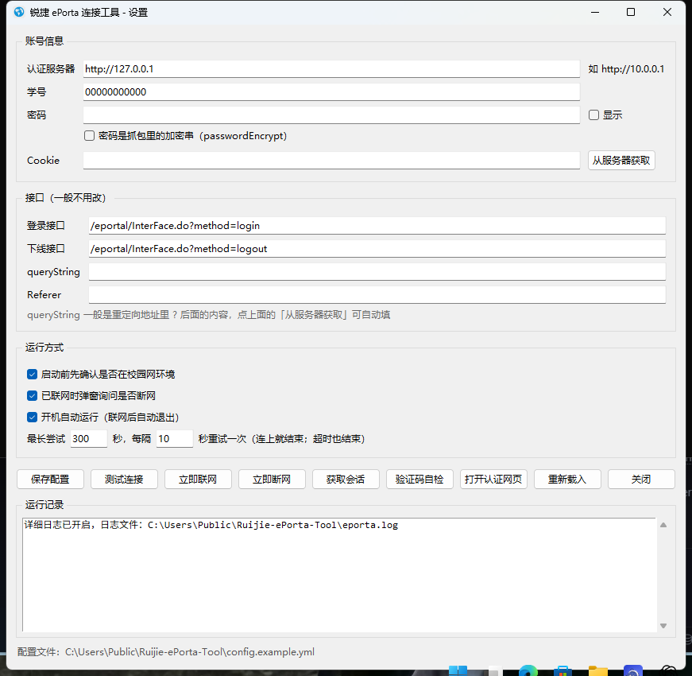

# 锐捷 ePortal 自动登录工具 · Windows 增强版

> 开机自动连校园网，连不上就每 10 秒重试一次，5 分钟后不管连没连上都自己退出；
> 图形验证码由程序自己识别 —— 全程不需要人管。

<p align="center">
  
</p>


一个基于 Python 的**锐捷 ePortal 网页认证**自动登录 / 断线工具。
本项目是 [Redlnn/Ruijie-ePorta-Tool](https://github.com/Redlnn/Ruijie-ePorta-Tool) 的 **Windows 增强分支**：
在原版基础上做了一轮完整的可维护性改造，补上了图形设置窗口、开机自启、失败重试、验证码自动识别和日志，
并去掉了所有会"下载二进制 / 依赖特定 Python 版本"的第三方依赖。

- 🖱 **有窗口**：不用手写 YAML，双击 `设置.bat` 就能改服务器地址、学号、密码
- 🚀 **开机自启**：写注册表 `HKCU\...\Run`，**不需要管理员权限**；开机后静默联网，成功即退出
- 🔁 **失败重试**：默认 5 分钟内每 10 秒重试一次；连上就收工，超时也收工，全程不弹窗
- 🔤 **验证码自动识别**：纯标准库实现的模板匹配（不装 Pillow、不装 OCR、不联网），认不出才弹窗问人
- 🔔 **系统通知**：走 Windows 原生 WinRT 通知，**不下载任何外部 DLL**
- 📄 **有日志**：每次运行都写 `eporta.log`（带时间戳、请求体、服务器原始回复，密码自动打码）
- 🧩 **依赖极少**：只依赖 `PyYAML`，其余全部标准库

---

## 目录

- [相比原版改了什么](#相比原版改了什么)
- [快速开始](#快速开始)
- [图形设置窗口](#图形设置窗口)
- [命令行参数](#命令行参数)
- [配置文件说明](#配置文件说明)
- [它是怎么工作的](#它是怎么工作的)
  - [自动抓 Cookie 与设备参数](#自动抓-cookie-与设备参数)
  - [登录请求体为什么必须照抄浏览器](#登录请求体为什么必须照抄浏览器)
  - [验证码是怎么自动识别的](#验证码是怎么自动识别的)
  - [开机自启与重试策略](#开机自启与重试策略)
- [出问题了怎么查](#出问题了怎么查)
- [常见问题](#常见问题)
- [目录结构](#目录结构)
- [开发与测试](#开发与测试)
- [已知限制](#已知限制)
- [鸣谢与协议](#鸣谢与协议)

---

## 相比原版改了什么

| 问题 | 原版 | 本版 |
| --- | --- | --- |
| Windows 11 上通知失效 | 用 `win32_ver()[0] == '10'` 判断，Win11 返回 `'11'`，所以永远走弹窗 | 直接尝试系统通知，成功就用，只有不可用才回退弹窗 |
| 第三方依赖 | `tinyWinToast` + `pywin32` + `pyyaml` | **只剩 `pyyaml`**：通知走系统自带 WinRT（经 Windows PowerShell 5.1），单实例锁用 `ctypes` 调 kernel32 |
| `tinyWinToast` 的隐患 | 首次弹通知会**从 GitHub 下载 `PoshWinRT.dll` 并执行**，还会往 site-packages 写 `toast.ps1` | 整条依赖已移除 |
| 断网请求 | 错误地拿 `login_data` 当请求体（`logout_data` 从未被使用） | 正确使用 `logout_data` |
| 配置文件位置 | 用 `dirname(sys.argv[0])`，`python -m` 或换目录调用会找错 | `--config` → 环境变量 `EPORTA_CONFIG` → 程序目录 → 项目根目录 → 当前目录 |
| 报错 | 缺 key 直接 `KeyError`，非 JSON 响应直接崩 | 全部转成中文提示；`--check` 一条命令体检 |
| 改配置 | 只能手写 YAML | **有图形设置窗口**，还有「获取会话」一键抓 Cookie |
| 联网报「WEB认证设备未注册」 | 只跟 HTTP 302，抓不到登录页参数，只能自己在配置里手拼（明文拼必被拒） | **自动跟 JS 跳转抓取服务器加密参数**，登录前自动补齐；参数失效会自动重抓 |
| 登录请求体和浏览器不一致 | 只发配置里写了的字段 | 按 `AuthInterFace.js` 的**八个字段、原顺序**发，`service=` / `validcode=` 这类空值**照样发** |
| 登录被要验证码 | 无处理，直接失败 | **自动识别验证码**（`src/captcha.py`），认不出才弹窗；用**取图那一轮的 cookie** 重登 |
| 登录失败后查不到原因 | 没有日志，开机自启连黑窗都没有 | 每次运行都写 `eporta.log`，另有 `--debug` |
| 开机自启 | 没有 | `--autostart on/off/status` 写注册表，开机静默联网 |
| 联网失败 | 直接退出 | `--retry`：默认 5 分钟内每 10 秒重试，连上即退出，超时也退出，全程不弹窗 |
| Python 版本 | `pyproject.toml` 锁死 `>=3.9, <3.11` | 放开为 `>=3.9`（在 Python 3.14.7 上实测可用） |

原版里其它几个小毛病也顺手修了：`MyToast` 定义了却从没被调用、`test_internet()` 里裸 `except`、`status['result']` 缺键崩溃。

---

## 快速开始

### 方式 A：下载 exe，双击就能用（推荐）

1. 到 [Releases](../../releases/latest) 下载 `Ruijie-ePorta-Tool-v1.6.2-win64.exe`（约 13 MB，**不需要装 Python**）
2. 双击它。第一次运行会**自己生成配置文件并直接打开设置窗口**，日志区写着「第一次使用：把学号和密码填上」
3. 填三样东西：
   - **认证服务器** —— 不知道填什么就点右边的「自动探测」，它会靠网关劫持时的跳转自动认出来
   - **学号**、**密码**
4. 点「保存配置」→ 点「测试连接」看是否可达 → 点「立即联网」

之后就随便用了：双击 exe 会按配置自动联网，勾上「开机自动运行」还能开机自动登录（5 分钟内反复重试，连上就收工）。

> **Windows 弹「已保护你的电脑」怎么办？**
> 因为这个 exe 没有买代码签名证书（个人项目，证书一年几百刀），SmartScreen 会拦一下。
> 点 **更多信息 → 仍要运行** 即可。介意的话请用下面的方式 B，从源码跑。
>
> 想验证 exe 没被动过手脚：`certutil -hashfile Ruijie-ePorta-Tool-v1.6.2-win64.exe SHA256`，
> 和 Release 页里写的哈希对一下。

### 方式 B：从源码跑

**0. 环境要求**

- Windows 10 / 11（系统通知依赖 Windows PowerShell 5.1，Win10 起都自带）
- Python 3.9 ~ 3.14（**推荐 3.11+**；本分支在 3.14.7 上开发验证）
- 只需要一个第三方库：`PyYAML`

**1. 获取代码**

```bat
git clone https://github.com/<你的用户名>/<仓库名>.git
cd <仓库名>
```

或者直接在 GitHub 上 `Code → Download ZIP` 解压。

**2. 安装依赖**

```bat
C:\Python314\python.exe -m venv .venv
.venv\Scripts\python.exe -m pip install -r requirements.txt
```

> 如果你的校园网还没认证，`pip` 可能会报 `SSLCertVerificationError`（HTTPS 被门户拦截了）。
> 先用浏览器登录一次校园网，再执行上面的命令即可。`build.bat` 里也内置了这种情况的处理。

**3. 填配置（三种方式任选）**

| 方式 | 怎么做 | 适合谁 |
| --- | --- | --- |
| **图形界面**（推荐） | 双击 `设置.bat`，填服务器地址 / 学号 / 密码，点「保存配置」 | 所有人 |
| 自动探测服务器 | 图形界面点「自动探测」，或命令行 `run.bat --detect-server` | 不知道 portal 地址的人 |
| 自动抓取会话 | 在图形界面点「获取会话」，或命令行 `run.bat --fetch-cookie` | 已经处在校园网、但不想抓包 |
| 手写 YAML | 复制 `config.example.yml` 为 `config.yml` 再照着改 | 习惯抓包的同学 |

配置模板长这样（`config.example.yml`）：

```yaml
url:
  server: http://127.0.0.1        # ← 改成你们学校的认证服务器地址（可用 --detect-server 探测）
login_data:
  userId: '00000000000'           # ← 学号，注意要加引号
  password:                       # ← 密码（明文时 passwordEncrypt 保持 false）
  passwordEncrypt: false
```

学生党最省事的路径：**双击 `设置.bat` → 点「自动探测」→ 填学号密码 → 点「测试连接」→ 点「立即联网」**。

**4. 先体检**

```bat
run.bat --check
```

它会检查配置文件、账号是否填了、Cookie 状态、认证服务器是否可达、外网是否通，不做任何登录动作。
排错先跑这个。

**5. 开机自启 + 5 分钟重试**

```bat
run.bat --autostart on      开启（写入 HKCU 的 Run 项，不需要管理员）
run.bat --autostart status  查看当前状态
run.bat --autostart off     关闭
```

开启后，每次开机都会以

```
pythonw.exe "…\src\__main__.py" --connect --retry
```

的方式静默运行：**连不上就每 10 秒重试一次，最多 5 分钟；连上就退出，超时也退出**，
成功 / 失败都会弹一条系统通知，并把过程写进 `eporta.log`。

也可以在图形界面里勾「开机自动运行」，效果一样。

---

## 图形设置窗口

双击 **`设置.bat`**（或 `run.bat --gui`）打开：

- **服务器地址 / 学号 / 密码 / Cookie** —— 密码框默认打码，可勾「显示密码」
- 服务器地址右边有 **「自动探测」** 按钮 —— 不知道 portal 地址就点它（靠网关劫持时的跳转自动认出来）
- **登录接口 / 下线接口 / queryString / Referer** —— 一般不用动
- **是否先确认校园网 / 已联网时是否询问断网** —— 现在默认都不问
- **开机自动运行**（勾选框，直接写注册表）
- **最长尝试 ___ 秒，每隔 ___ 秒重试一次** —— 默认 300 / 10

按钮：`保存配置`、`测试连接`、`立即联网`、`立即断网`、`获取会话`、`验证码自检`、`打开认证网页`、`重新载入`。
下面那块文本区是运行记录，所有操作结果都写在里面，不用开黑窗也看得见。

> **第一次使用（还没有 `config.yml`）**：直接双击程序（exe 或 `设置.bat`）就会自动生成配置模板、
> 弹出这个窗口，日志区里写着「第一次使用：把「学号」和「密码」填上」，服务器地址那行也会自动探测一次。
> 你只要填两样东西、点「保存配置」就完事了。

---

## 命令行参数

| 参数 | 说明 |
| --- | --- |
| （无） | 常规运行：联网 / 询问断网。**没有配置文件时会自动建一份并打开设置窗口** |
| `--gui` | 打开图形设置窗口（等于双击 `设置.bat`） |
| `--check` | 只体检，不登录不断网。**排错先跑这个** |
| `--detect-server` | 自动探测校园网认证服务器地址（找网关 302 跳转），结果填进 `url.server` |
| `--gen-config` | 生成默认配置模板 |
| `--fetch-cookie` | 连一次认证服务器，自动抓回 `cookie` 和 `queryString` 并写回配置 |
| `--open-login` | 用默认浏览器打开认证网页手动登录（自动登录失灵时的兜底） |
| `--test-captcha` | 取一张验证码图片做识别并报结果（不登录，用来确认识别是否正常） |
| `--connect` | 网络不通时直接联网，不弹确认框（适合开机自启） |
| `--disconnect` | 已联网时直接断网，不弹确认框 |
| `--retry` | 连不上就反复重试，直到连上或超时（开机自启用这个） |
| `--timeout SEC` | 重试总时长，覆盖配置里的 `auto.retry_timeout`（默认 300） |
| `--interval SEC` | 重试间隔，覆盖配置里的 `auto.retry_interval`（默认 10） |
| `--autostart on\|off\|status` | 开关开机自启 / 查看当前状态 |
| `--debug` | 把请求体、请求头、服务器原始回复写进日志（密码与验证码自动打码） |
| `--console` | 把头信息打到控制台。**加了它就不弹对话框**（写在批处理/脚本里不会被卡住），没加则在双击运行时弹窗报错 |
| `--no-toast` | 不用系统通知，改回弹窗 |
| `--config PATH` | 指定别的 `config.yml` |

三种调用方式等价：

```bat
run.bat --check
.venv\Scripts\python.exe src\__main__.py --check
.venv\Scripts\python.exe -m src --check        rem 需在项目根目录执行
```

> 用 `-m src` 时 Python 会提示一行 `RuntimeWarning: 'src.__main__' found in sys.modules...`，
> 这是 `python -m` 对包内 `__main__` 的常规提醒，不影响功能。

---

## 配置文件说明

```yaml
main:
  version: 3                     # 配置版本号，别改

funtion:
  check_school_network: true     # 是否先检查校园网环境
  disconnect_network: false      # 已联网时是否询问断网（false = 连上就收工）

url:
  server: http://10.0.0.1        # 认证服务器地址
  login:  /eportal/InterFace.do?method=login
  logout: /eportal/InterFace.do?method=logout

cookie: ''                       # 建议留空，联网前自动抓；服务器只在"本机未认证"时才下发正确值

login_data:
  userId: '00000000000'          # 学号（要加引号，否则 YAML 会当数字）
  password: ''                   # 明文密码；如果抓包里是加密串，就把 passwordEncrypt 设为 true
  service: ''                    # 走 SSO 的学校可能要填，一般留空
  queryString: ''                # 设备参数，强烈建议留空自动抓（见下）
  operatorPwd: ''                # 运营商相关，一般留空
  operatorUserId: ''
  validcode: ''                  # 验证码，留空自动识别
  passwordEncrypt: false

logout_data: {}                  # 下线参数，一般不用填

auto:
  retry_timeout: 300             # --retry 的总时长（秒）
  retry_interval: 10             # 重试间隔（秒）

headers:
  Referer: ''                    # 有些学校需要，按抓包填
```

> **`queryString` 千万不要用明文 IP / MAC 自己拼。**
> 锐捷 ePortal 的 `wlanuserip` / `wlanacname` / `nasip` / `mac` 是**服务器加密过的十六进制串**，
> 明文自拼一定会被拒，并回你一句吓人的「WEB认证设备未注册，请确认SAM+/portal/设备上的参数配置是否一致」。
> 留空让程序自动抓就对了；程序会在登录前的最后一刻补齐，参数失效还会自动重抓一次。

---

## 它是怎么工作的

```
                 ┌──────────────────────────────┐
   开机 / 手动 → │ 读取 config.yml              │
                 └──────────────┬───────────────┘
                                ↓
                 ┌──────────────────────────────┐
                 │ 外网探测 generate_204        │──通了──→ 收工（发通知）
                 └──────────────┬───────────────┘
                                ↓ 不通
                 ┌──────────────────────────────┐
                 │ 抓登录页参数（302 / JS 跳转  │
                 │ / SSO redirect_uri 三条路）  │→ queryString + JSESSIONID
                 └──────────────┬───────────────┘
                                ↓
                 ┌──────────────────────────────┐
                 │ POST InterFace.do?method=login│
                 │ 八个字段、顺序照抄浏览器      │
                 └──────────────┬───────────────┘
          fail「验证码」→ 取图 → 识别 → 重登（最多 3 张）
          fail「设备未注册」→ 清参数 → 自动重抓 → 再登一次
                                ↓
                        成功 → 通知 → 退出
                        失败 → 10 秒后重试，最长 5 分钟
```

### 自动抓 Cookie 与设备参数

未认证状态下，ePortal 把你送去登录页的方式**不止 302**：

1. 普通 HTTP 302 重定向；
2. **JavaScript 跳转**——很多校园网实际用的是这种，响应体里是一段
   `<script>top.self.location.href='http://portal/eportal/index.jsp?wlanuserip=...'</script>`；
   只跟 HTTP 重定向链的话会停在被劫持的地址上，永远抓不到参数（这就是原版「设备未注册」的根因）；
3. 走统一身份认证（SSO）的学校：跳到 OAuth 页时，真正的设备参数藏在 `redirect_uri` 里面。

`src/session.py` 三条路都跟，抓到 `queryString` 和那一次的 `JSESSIONID` 之后写回配置。
参数被服务器拒了就清空重抓，形成自愈。

### 登录请求体为什么必须照抄浏览器

打开 `AuthInterFace.js` 能看到浏览器拼的表单是：

```js
userId=..&password=..&service=&queryString=..&operatorPwd=&operatorUserId=&validcode=&passwordEncrypt=false
```

注意 `service` / `operatorPwd` / `operatorUserId` / `validcode` **是空的也照样发**。
早期版本"为了干净"把空值参数过滤掉了，服务器就可能把请求当成"没带验证码"而回「验证码错误」——
出现"浏览器一次就登上、自动登录被拒"的怪现象。现在字段和顺序与浏览器完全一致。

### 验证码是怎么自动识别的

有些 ePortal 要求图形验证码（`/eportal/validcode` 返回一张 80×30 的 4 位数字 PNG，
并且**同时下发一个新的 `JSESSIONID`**，登录必须带着取图那一轮的 cookie，否则照样报「验证码错误」）。

本项目的做法是**纯标准库的模板匹配**（`src/captcha.py`，不依赖 Pillow / numpy / 任何 OCR）：

1. 手写 PNG 解码（8bit 真彩 + 四种滤波），按"接近白色即背景"二值化；
2. 按空白列切出 4 个字形，各自裁到最小外接矩形；
3. 与内置的 10 个数字模板逐一比对，**允许 ±1 像素平移**取最小差异；
4. 判据：`best ≤ 8` 且 `best` 与次优相差 `≥ 6` 才认，否则交给人工。

为什么这么简单就够用：这类验证码是**固定字体渲染的位图**——白底、纯色字、无噪点、无旋转、无粘连。
实测采集 40 张、切出 160 个字形，恰好聚成 10 类：**同一类内部像素完全相同（差异 0）**，
而**不同类之间最小也要差 61 个像素**（最像的一对是 `3` 和 `5`）。安全边际非常宽。

随时可以自检（只取一张图，不登录、不影响上网）：

```bat
run.bat --test-captcha --console
```

它会打印识别结果，并把那张图存成 `validcode_last.png` 供你肉眼对一眼。
**如果你的学校验证码字体不同**，仓库里带了一个重新标定的小工具：

```bat
.venv\Scripts\python.exe tools\captcha_calibrate.py --count 40
```

它会抓一批验证码、聚类、打印每个类的 ASCII 字形（照着认一下是哪个数字即可），
并按 `tools/captcha_calibrate.py` 的提示生成新的模板数据，替换 `src/captcha.py` 里的 `_TEMPLATE_DATA` 即可。

### 开机自启与重试策略

- 自启写的是 `HKCU\Software\Microsoft\Windows\CurrentVersion\Run` 里的 `RuijieEPortaTool`，
  **只影响当前用户、不需要管理员权限**，用 `--autostart off` 或任务管理器都能删掉。
- 重试是一个 `deadline` 循环：`--connect --retry` 之后先测外网，通了立刻退出；
  没通就登录，失败则等 `retry_interval` 秒再来一轮，直到 `retry_timeout` 用完。
- 全程用「静默模式」跑：**不弹任何模态框**（开机时弹框会挡住桌面），
  状态变化通过系统通知告知；第一轮失败只发一条「正在后台重试」，避免刷屏。
- 重试期间如果发现服务器要验证码：无人值守也照样走自动识别；
  万一连续 3 张都认不出来，会明确发通知提示手动登录一次，而不是白等 5 分钟。

---

## 出问题了怎么查

**每次运行都会在同目录写一个 `eporta.log`**（默认就是 `config.yml` 旁边），带时间戳、追加写入。
这很关键：开机自启是用 `pythonw` 跑的，**没有黑窗，控制台输出全丢**，只能看这个文件。

```
===== 锐捷 ePorta 连接工具 1.6-local 启动：['--connect', '--retry'] =====
2026-01-01 08:00:01  日志文件：…\eporta.log
2026-01-01 08:00:01  第 1 次尝试：联网成功。
```

图形界面和命令行都默认记详细日志（请求地址、请求头、请求体、服务器原始回复）；
密码和验证码会自动打码成 `***`，**可以直接把整个文件发出来求助**。
只想在命令行看详细过程：`run.bat --debug --connect`。

**开机后想知道成功没成功，搜这几句就行**：

| 日志里出现 | 含义 |
| --- | --- |
| `第 1 次检查：已联网，任务完成。` | 开机时网本来就是通的，什么都没做 |
| `第 N 次尝试：联网成功。` | ✅ 自动登录成功 |
| `N 秒内未能联网，程序退出。` | 5 分钟到了还没连上，程序自己退出了 |
| `之前的设备参数已失效，已重新抓取，再登录一次…` | 参数过期，正在自愈重抓（正常过程） |
| `已自动获取登录页参数（wlanuserip/nasip/mac 等）…` | 成功抓到了服务器加密过的设备参数 |
| `验证码自动识别：9323（每位差异 9:0 3:0 2:0 3:0）` | 自动认出了验证码（差异 0 = 与模板完全一致） |
| `验证码自动识别：没认出来（…）` | 这张图认不出，会换一张再试，试满 3 张才放弃 |
| `[调试] 请求体: userId=…&password=***&service=&…` | 这次真正发出去的参数 |
| `[调试] HTTP 200，原始回复: {"result":"fail","message":"…"}` | **服务器拒绝的原话**，失败原因基本都在这句里 |

---

## 常见问题

<details>
<summary><b>联网时提示「WEB认证设备未注册，请确认SAM+/portal/设备上的参数配置是否一致」</b></summary>

说明 `queryString` 里的设备参数不对。两种可能：

1. 你自己手写了明文 IP / MAC —— 不行，必须是服务器加密过的十六进制串，**把 `queryString` 清空**让程序自动抓；
2. 之前抓的参数过期了（换了网口 / 换了 Wi-Fi / 隔了太久）—— 程序现在遇到这个报错会**自动清空重抓并重试一次**，
   通常第二次就成功了；还不行就跑 `run.bat --fetch-cookie` 手动抓一次。

</details>

<details>
<summary><b>提示「验证码错误」</b></summary>

先确认是哪种：

- 服务器**真的**要验证码：程序会自动取图并识别，正常情况下你看不到这个报错；
  连续 3 张都没认出来才会放弃，此时用 `run.bat --test-captcha` 看看识别是否正常。
- 服务器**并没有**要验证码却回这四个字：那多半是**请求体里的参数少了**。
  浏览器提交的表单里 `service` / `operatorPwd` / `operatorUserId` / `validcode` 是空的也照样发，
  本版已经照抄；如果你在旧版本上遇到，升级即可。

</details>

<details>
<summary><b>双击 exe 时 Windows 弹「已保护你的电脑」（SmartScreen）</b></summary>

因为这个 exe **没有买代码签名证书**（个人项目，证书要按年付费），Windows 会先拦一下。
点 **更多信息 → 仍要运行** 就能打开。这是 SmartScreen 对"没见过的、没签名的程序"的默认动作，
不代表文件有问题。

想核对文件有没有被改过：

```bat
certutil -hashfile Ruijie-ePorta-Tool-v1.6.2-win64.exe SHA256
```

和 Release 说明里写的哈希对一下即可，一致就放心用。实在不放心就用「方式 B：从源码跑」，
源码全在仓库里，自己 `pip install pyyaml` 就能跑。

</details>

<details>
<summary><b>不知道我们学校的认证服务器地址是什么</b></summary>

三种办法任选：

1. 图形窗口里点 **「自动探测」**（命令行 `run.bat --detect-server`）—— 它会请求几个公共的"连通性检测"网址，
   校园网网关会把你 302 劫持到认证页，从 `Location` 里就能读出 portal 地址；
2. 用浏览器打开任意一个 `http://` 网站，看地址栏自动跳到了哪；
3. 抓一次包看 `InterFace.do?method=login` 发给了谁。

注意：**已经联网时探测不到**（网关不劫持了），这时随便填一个也行——只要 `check_school_network` 为 `false`，
程序不会因为地址不通就不干活。

</details>

<details>
<summary><b>提示「认证失败」</b></summary>

这四个字很笼统：实测把密码**故意写错**，服务器回的也是「认证失败」，
所以在"已经在线"的状态下无法据它区分"密码错 / 参数过期 / 重复登录"。
排查顺序：确认密码对不对 → 跑 `run.bat --fetch-cookie` 重抓参数 → 看 `eporta.log` 里 `[调试]` 那几行的服务器原话。

</details>

<details>
<summary><b>不弹系统通知 / 通知里没有图标</b></summary>

通知走的是 Windows PowerShell 5.1 调 WinRT（`Windows.UI.Notifications`）。
`run.bat --check` 会打印「系统通知：可用（Windows 通知中心）」或回退说明。
如果系统里把"Windows PowerShell"的通知权限关掉了，会退化成 tkinter 弹窗——功能不受影响。
注意**PowerShell 7（pwsh）不能**加载 WinRT 类型，所以工具固定调用系统自带的 5.1。

</details>

<details>
<summary><b>装依赖 / 打包时 pip 报 <code>SSLCertVerificationError</code></b></summary>

校园网还没认证时，HTTPS 会被门户拦截并返回一张自签证书，pip 因此校验失败。
先用浏览器登录一次校园网，或者先跑 `run.bat --connect`，然后再装。
`build.bat` 里已经内置了"失败就用 Windows 证书库重试 / 再退到免校验"的三级兜底。

</details>

<details>
<summary><b>想打包成单文件 exe 发给同学</b></summary>

```bat
build.bat
```

产物在 `dist\` 下（onefile、无控制台、带图标和版本信息）。
exe 不含任何账号信息，把它和一份 `config.yml`（或让同学双击「获取会话」）放在一起就能用。
注意 `设置.bat` / `run.bat` 是给源码方式用的，跑了 exe 之后直接用
`锐捷 ePorta 连接工具.exe --gui` 或 `--connect --retry` 即可。

</details>

<details>
<summary><b>怎么彻底卸载 / 关掉开机自启</b></summary>

```bat
run.bat --autostart off
```

或者任务管理器 → 启动 → 禁用 `RuijieEPortaTool`，再删掉整个目录即可（不写系统目录、不装服务）。

</details>

---

## 目录结构

```
.
├─ 设置.bat                    打开图形设置窗口（双击即用）
├─ run.bat                     命令行启动脚本（双击即用）
├─ build.bat                   打包成单文件 exe
├─ config.example.yml          配置模板（复制成 config.yml 使用）
├─ requirements.txt            依赖（只有 PyYAML）
├─ pyproject.toml              包元数据（版本号在这里改）
├─ src/
│  ├─ __init__.py               让 `python -m src` 也能跑
│  ├─ __main__.py              主流程、命令行、重试循环
│  ├─ gui.py                   图形设置窗口（tkinter，零依赖）
│  ├─ captcha.py               验证码识别（纯标准库模板匹配）
│  ├─ session.py               自动抓 Cookie / queryString / 验证码
│  ├─ config.py                配置定位、生成、保留注释地写回、校验
│  ├─ notifier.py              系统通知（零第三方依赖）
│  ├─ autostart.py             开机自启（HKCU Run 项）
│  └─ wangluo.ico              图标
├─ tools/
│  └─ captcha_calibrate.py     验证码模板重新标定工具
├─ tests/
│  └─ test_mock_eportal.py     内置模拟服务器，跑一遍登录/自愈/验证码流程
├─ docs/gui.png                设置窗口截图
├─ Windows-Ruijie.spec         PyInstaller 配置
├─ version.txt                 exe 的版本信息（含上游版权署名）
├─ CHANGELOG.md                改动记录
├─ NOTICE.md                   第三方依赖与来源声明
└─ LICENSE                     AGPL-3.0（继承自上游，请保留）
```

---

## 开发与测试

仓库自带一个**模拟 ePortal 服务器**的测试脚本，不需要真的连校园网，也不会碰你的网络：

```bat
.venv\Scripts\python.exe tests\test_mock_eportal.py
```

它会在本机起一个小 HTTP 服务，扮演认证服务器（**包含验证码图片，图片是用 `src/captcha.py`
自己的模板现画出来的**），覆盖：

- 什么都不填也能登录：自动抓设备参数 → 自动识别验证码 → 登录成功（全程无人参与）
- 登录请求体是否与浏览器一致（八个字段、空值也发）
- 设备参数失效时能否**在同一次调用内自愈**（清参数 → 重抓 → 再登一次）
- 未认证时用 **JS 跳转**（而不是 302）下发参数时，是否还能抓到
- 验证码：识别成功 / 第一张图坏了换一张 / 一直认不出来则明确失败并标记原因
- 正常断网（并断言**断网请求体用的是 `logout_data`**，不会再把登录参数发过去）
- 已经联网时不重复登录、要求断网时直接跳过、一直连不上则到点退出

改代码时请保持 `python -m py_compile src\*.py` 通过，并跑一遍上面这个脚本。

---

## 已知限制

- **「未认证 → 自动登录成功」这条完整链路没有在真实校园网里被完整验证过。**
  开发时能复现的状态是"机器已经在线"，而在线状态下服务器会对登录请求短路（回 `success` 或直接拒绝），
  参数其实没有被真正校验。所以请把本工具当作"已经能跑、但在你的学校需要一次实机验证"的状态：
  第一次用建议手动跑 `run.bat --connect --console` 看日志，确认无误再开自启。
- **登录返回 `success` 要打个折扣**：已认证的设备请求登录时服务器可能直接返回 `success`，
  这并不代表参数被校验过。
- **验证码模板是针对性标定的**：仓内的 10 个模板对应一种 80×30、4 位数字的常见锐捷验证码。
  字体不同的学校需要用 `tools/captcha_calibrate.py` 重新标定（几分钟的事）。
- **只在 Windows 上验证过**：通知与开机自启是 Windows 专属；`--connect` / `--check` 这类纯请求逻辑理论上跨平台，但没测。
- **不要为了测试而断网**：`--disconnect` 会真的把你踢下线，请确认手头的事情做完了再试。

---

## 鸣谢与协议

- 上游项目：[**Redlnn/Ruijie-ePorta-Tool**](https://github.com/Redlnn/Ruijie-ePorta-Tool)
  （作者 Red_lnn，AGPL-3.0）。本仓库是它的衍生分支，请一并遵守 AGPL-3.0：**保留版权声明、修改后同样开源**。
- 抓包与填写方法可参考上游作者的教学视频：BV1TZ4y167b6。
- 本分支的改动集中在：图形界面、开机自启、重试策略、验证码识别、自动抓参数、日志与错误处理、依赖精简。
  代码里的中文注释与文档均为本分支新增/改写。
- 本项目仅用于**自动化你自己的、合法的校园网登录**，方便开机后自动联网。
  请遵守所在学校的网络使用规定；因使用不当造成的一切后果由使用者自负。

```
Copyright (C) 2022 Red_lnn            (上游原作者)
Copyright (C) 2026 <你的名字>          (本分支的修改)
SPDX-License-Identifier: AGPL-3.0-only
```
